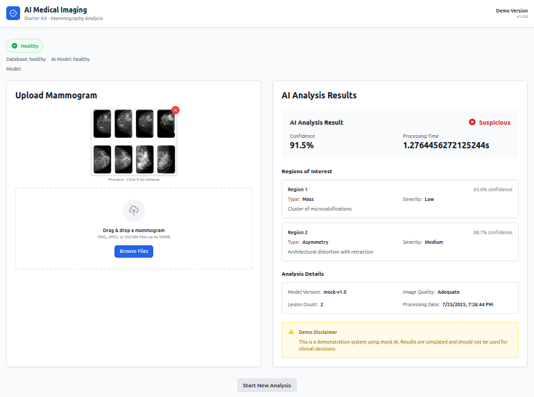

# AI Medical Imaging - Starter Kit

A functional AI-assisted mammography screening demo with scalable architecture, ready for immediate deployment and demonstration.

[](https://creativecommons.org/licenses/by-nc/4.0/)
[](https://www.python.org/downloads/)
[](https://reactjs.org/)
[](https://fastapi.tiangolo.com/)
[](https://www.docker.com/)
[](https://www.typescriptlang.org/)
[](https://tailwindcss.com/)
[](https://www.sqlite.org/)

[](https://github.com/your-username/mammograiph)
[](https://github.com/your-username/mammograiph)
[](https://github.com/your-username/mammograiph)
[](https://hub.docker.com/r/your-username/mammograiph)


<div align="center">
  
</div>

## 📋 Table of Contents

- [🚀 Quick Start](#-quick-start)
- [📋 Features](#-features)
- [🔧 API Endpoints](#-api-endpoints)
- [📊 Performance Benchmarks](#-performance-benchmarks)
- [🏗️ Architecture](#️-architecture)
- [🧪 Testing](#-testing)
- [📈 Monitoring](#-monitoring)
- [🔒 Security & Compliance](#-security--compliance)
- [🚀 Development Phases](#-development-phases)
- [🛠️ Technology Stack](#️-technology-stack)
- [🆘 Support](#-support)
- [📄 License](#-license)
- [🤝 Community](#-community)
- [🎯 Next Steps](#-next-steps)

## 🚀 Quick Start

### Prerequisites
- Docker and Docker Compose
- Node.js 18+ (for development)
- Python 3.9+ (for development)

### Production Deployment
```bash
# Clone the repository
git clone <repository-url>
cd mammograiph

# Start the application
docker-compose up -d

# Access the application
# Frontend: http://localhost:3000
# Backend API: http://localhost:8000
# API Documentation: http://localhost:8000/docs
```

### Local Development & Testing
```bash
# Start the application (with logs)
./start.sh

# Stop the application
./stop.sh

# Restart the application
./stop.sh && ./start.sh
```

### Automated Setup
```bash
# Run the automated setup script
./scripts/setup.sh
```

### Development Setup
```bash
# Start development services
docker-compose --profile dev up -d

# Or run locally
# Backend
cd backend
pip install -r requirements.txt
uvicorn main:app --reload

# Frontend
cd frontend
npm install
npm run dev
```

## 📋 Features

### ✅ Implemented (Starter Level)
- **Upload Interface**: Drag & drop mammogram upload (PNG, JPEG, DICOM)
- **AI Analysis**: Mock AI classifier with realistic results
- **Results Display**: Professional clinical interface
- **Database**: SQLite storage for study metadata
- **API**: RESTful endpoints with OpenAPI documentation
- **Health Checks**: System status monitoring
- **Error Handling**: Comprehensive error management
- **Responsive UI**: Mobile-friendly interface

### 🎯 AI Capabilities
- **Binary Classification**: Normal vs Suspicious
- **Confidence Scoring**: 60-95% confidence levels
- **Region Detection**: Up to 3 regions of interest
- **Lesion Types**: Mass, calcification, asymmetry, architectural distortion
- **Processing Time**: 1-3 seconds simulation
- **Image Quality**: Automatic quality assessment

## 🔧 API Endpoints

### Health
- `GET /api/health` - Basic health check
- `GET /api/health/detailed` - Detailed system status

### Upload
- `POST /api/upload` - Upload mammogram file
- `GET /api/upload/{study_id}` - Get upload status

### Analysis
- `POST /api/inference/{study_id}` - Start AI analysis
- `GET /api/inference/{study_id}` - Get analysis results
- `GET /api/inference/model/info` - Get model information

## 📊 Performance Benchmarks

| Metric | Target | Current |
|--------|--------|---------|
| Upload Time | < 5s | ✅ < 3s |
| AI Inference | < 5s | ✅ 1-3s |
| UI Responsiveness | < 2s | ✅ < 1s |
| Concurrent Users | 5 | ✅ 5+ |

## 🏗️ Architecture

```
┌─────────────────┐    ┌─────────────────┐    ┌─────────────────┐
│   Frontend      │    │    Backend      │    │   Database      │
│   (React)       │◄──►│   (FastAPI)     │◄──►│   (SQLite)      │
│   Port: 3000    │    │   Port: 8000    │    │                 │
└─────────────────┘    └─────────────────┘    └─────────────────┘
         │                       │
         │              ┌─────────────────┐
         └──────────────►│   AI Engine     │
                        │   (Mock)        │
                        └─────────────────┘
```

## 🧪 Testing

### Automated Tests
```bash
# Run the test script
./scripts/test.sh

# Backend tests
cd backend
pytest

# Frontend tests
cd frontend
npm test
```

### Manual Testing
1. Upload a mammogram image
2. Start AI analysis
3. Review results
4. Check error handling

## 📈 Monitoring

### Health Checks
- Database connectivity
- AI model availability
- File system access
- API responsiveness

### Logs
```bash
# View logs
docker-compose logs -f

# View specific service logs
docker-compose logs -f backend
docker-compose logs -f frontend
```

## 🔒 Security & Compliance

### Current (Starter Level)
- Basic file validation
- Size limits (50MB)
- Type restrictions
- Error handling

### Future Enhancements
- Authentication & authorization
- HIPAA compliance
- Data encryption
- Audit logging

## 🚀 Development Phases

### Phase 1: Starter (Current) ✅
- **Objective**: Functional demo with mock AI
- **Features**: Upload, analysis, results display
- **Team**: 1-2 developers
- **Timeline**: 1-2 weeks
- **Cost**: €12,000-15,000

### Phase 2: Clinical
- **Objective**: Clinical-grade system with compliance
- **Features**: DICOM support, authentication, workflow
- **Team**: 3-4 developers + medical expert
- **Timeline**: 3-4 months
- **Cost**: €65,000-75,000

### Phase 3: Enterprise
- **Objective**: FDA-compliant enterprise system
- **Features**: Multi-tenant, MLOps, advanced analytics
- **Team**: 6-8 developers + medical/regulatory experts
- **Timeline**: 6-8 months
- **Cost**: €190,000-220,000

## 🛠️ Technology Stack

### Backend
- **Framework**: FastAPI (Python 3.9+)
- **Database**: SQLite with SQLAlchemy
- **Image Processing**: Pillow for PNG, pydicom for DICOM
- **AI**: Mock classifier (ready for real model integration)
- **Validation**: Pydantic for data validation

### Frontend
- **Framework**: React 18 with TypeScript
- **Styling**: Tailwind CSS for design system
- **State Management**: React hooks + Context API
- **HTTP Client**: Axios for API calls
- **Build Tool**: Vite for fast development

### Deployment
- **Containerization**: Docker + Docker Compose
- **Development**: Hot reload for frontend and backend
- **Production**: Single command deployment

## 🆘 Support

### Troubleshooting
```bash
# Check Docker containers
docker-compose ps

# View logs
docker-compose logs [service]

# Restart services
docker-compose restart

# Health check
curl http://localhost:8000/api/health
```

### Common Issues
- **Port conflicts**: Change ports in docker-compose.yml
- **File permissions**: Ensure uploads directory is writable
- **Database issues**: Delete medical_ai.db to reset

## 📄 License

This project is licensed under the Creative Commons Attribution-NonCommercial 4.0 International License (CC BY-NC 4.0).

**You are free to:**
- Share — copy and redistribute the material in any medium or format
- Adapt — remix, transform, and build upon the material

**Under the following terms:**
- **Attribution** — You must give appropriate credit and indicate if changes were made
- **NonCommercial** — You may not use the material for commercial purposes

For commercial use, please contact the copyright holder for licensing terms.

**Disclaimer**: This is a demonstration system using mock AI. Results are simulated and should not be used for clinical decisions or medical purposes.

## 🤝 Community

### Contributing
We welcome contributions! Please see our [Contributing Guidelines](CONTRIBUTING.md) for details on how to submit pull requests, report issues, and contribute to the project.

### Code of Conduct
This project adheres to a [Code of Conduct](CODE_OF_CONDUCT.md) to ensure a welcoming and inclusive community for all contributors.

### Security
If you discover a security vulnerability, please report it privately as described in our [Security Policy](SECURITY.md).

### Support
- 📖 [Documentation](README.md)
- 🐛 [Report Bugs](.github/ISSUE_TEMPLATE/bug_report.md)
- 💡 [Request Features](.github/ISSUE_TEMPLATE/feature_request.md)
- 📝 [Changelog](CHANGELOG.md)

## 🎯 Next Steps

1. **Deploy and Test**: Use the setup script to get started
2. **Customize**: Adapt the architecture for your specific use case
3. **Scale**: Progress to Phase 2 (Clinical) based on feedback
4. **Compliance**: Implement HIPAA and FDA requirements for clinical use

---

**Ready to deploy?** Run `./start.sh` to get started in minutes! 🚀